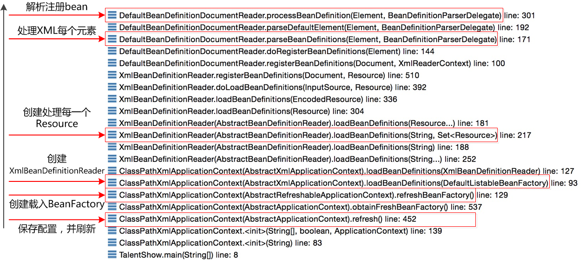
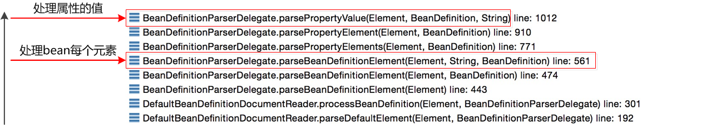
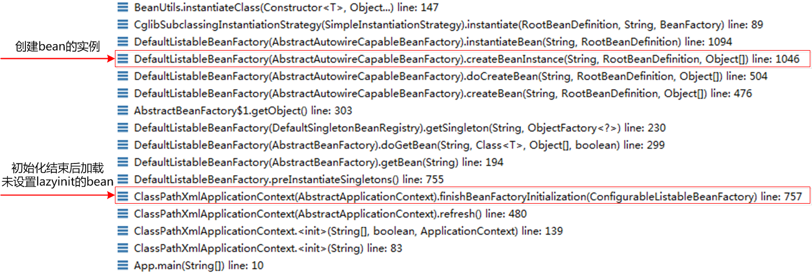

IOC主要有两个流程，一个是注入，一个是实例化

大致单步跟了下Spring IOC的初始化过程，整个脉络很庞大，初始化的过程主要就是读取XML资源，并解析，最终注册到Bean Factory中：

加载时需要读取、解析、注册bean，这个过程具体的调用栈如下所示： 

解析xml对应到bean

注入依赖

**相关面试题**

https://blog.csdn.net/a745233700/article/details/80959716