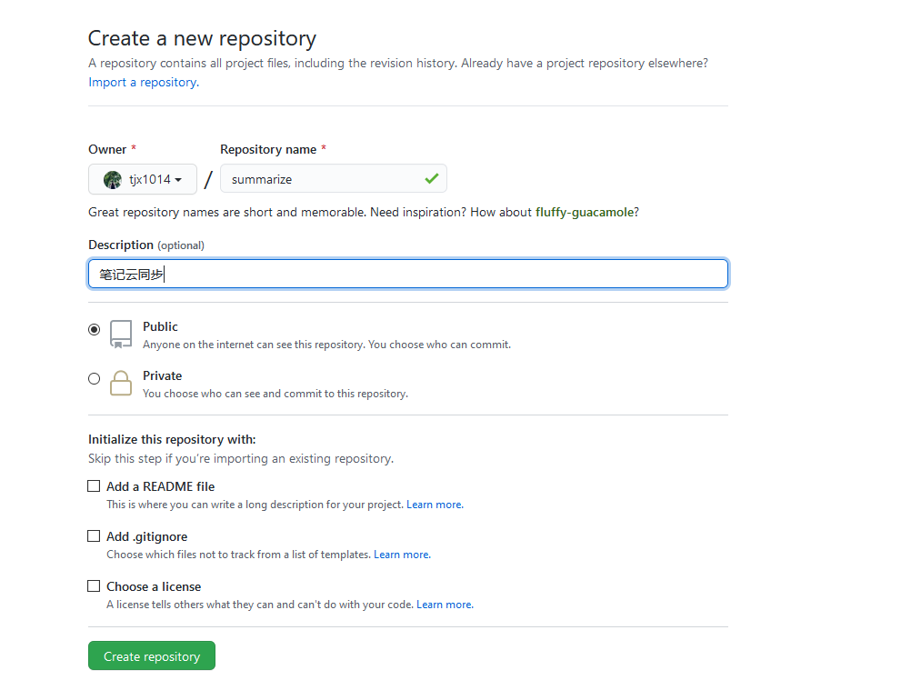
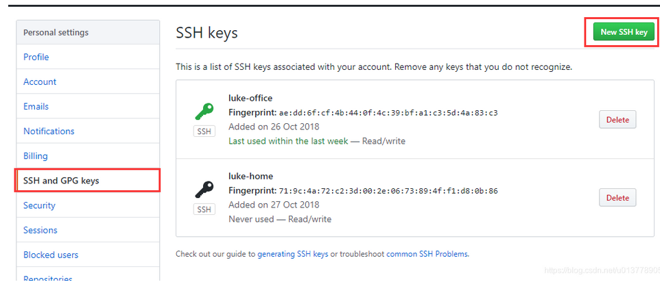

# 配置git同步文档


## 创建一个git仓库




## 配置SSH Key

### 一、设置git的user name和email

如果你是第一次使用，或者还没有配置过的话需要操作一下命令，自行替换相应字段。

```git
git config --global user.name "tjx"
git config --global user.email  "1095288440@qq.com"
```

### 二、检查是否存在SSH Key

```git
cd ~/.ssh
ls
或者
ll
//看是否存在 id_rsa 和 id_rsa.pub文件，如果存在，说明已经有SSH Key
```

 如果没有SSH Key，则需要先生成一下

```git
ssh-keygen -t rsa -C "1095288440@qq.com"
```

### 三、获取SSH Key

```git
cat id_rsa.pub
//拷贝秘钥 ssh-rsa开头
```

### 四、GitHub添加SSH Key


GitHub点击用户头像，选择setting--> SSH And GPG Keys  里面添加一个 SSH 

取个名字，把之前拷贝的秘钥复制进去，添加就好啦。



### 