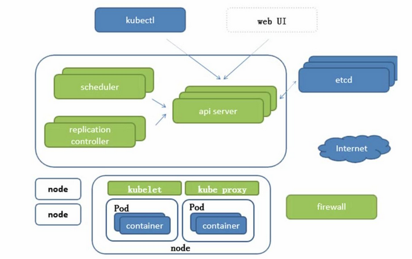

## 前世今生

MESOS(阿帕奇)  --->  Docker Swarm(docker 子公司)  --> Kubernetes(谷歌)

进阶https://www.bilibili.com/video/BV1Et411j7R2/?spm_id_from=333.788.videocard.3

## 特点

轻量化:资源消耗低、开源、弹性伸缩(IPVS) 

## 基本概念

#### Pod

#### 控制器类型

#### 网络通信模式

#### 资源清单

#### 服务发现

#### 存储

#### 调度器

#### 安全

#### HELM

## 架构

#### api server 

所有服务的入口

crontrollerManager:维持副本的期望数